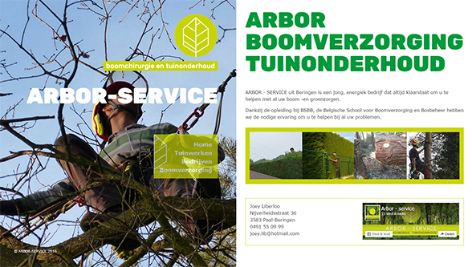

#ARBOR-service
 A Drupal8 theme for Joey. A tree care and gardening service.

##Structure
  

Splitscreen layout voor de desktop versie, voor de mobile versie wordt enkel de rechterkant getoond.

###Menu
Het beperkte menu op het linkerdeel is geen Drupal menu, het onderste item dient ook enkel om het submenu (bomen)
te tonen, dit schuifsysteem enkel met CSS, een tutorial op https://github.com/illutek/SlideOutNavigation 

###Bomenpagina's
De sidebar (submenu bomen) zal altijd zichtbaar moeten blijven, dus beste manier is om een aparte page aan te maken 
page--bomen.tpl.php bijvoorbeeld (page--bomen.html.twig), dit hebben we niet gedaan
Een extra class toegevoegd aan left-fixed-container, nl. trees op de bomen html pagina's, met een extra 
_leftSideTrees.scss bestand zorgen dat de sidebare steeds zichtbaar is, dit via de extra class dat de pagina meekrijgt
via het inhoudstype 'trees' (class 'page-node-type-trees')

###Block pagetitle
Deze via de node.html.twig uitgeschakeld, door de if structuur ```if not page``` opzij te zetten.

###Block tabs
Ook enkel zichtbaar voor de role administrator.

##Tools
###Bootstrap
  
Bootstrap makes front-end web development faster and easier. It's made for folks of all skill levels, devices of 
all shapes, and projects of all sizes.  
http://getbootstrap.com/

###Photoshop CS6
  
Ontwerp van de site met Photoshop CS6. 
Overzicht van voorstellen op dropbox  
https://www.dropbox.com/sh/fgmsatyajys6baz/AAB-_LUKQ-OBPGW0S6wxQUD9a?dl=0

###GIT
  
Git is a free and open source distributed version control system designed to handle everything from small to 
very large projects with speed and efficiency.

###PhpStorm 9.0
  
Als editor maar ook als css compiler (Ruby), ook ftp (Remote host), voordeel tegenover bv Filezilla, via synchronize
zie je onmiddelijk wat het verschil is tussen de locale en remote versies.  
https://www.jetbrains.com/phpstorm/?fromMenu

###SASS
  
Gewoon css schrijven is niet meer aan de orde, het complileren van scss naar css via phpStrom (Ruby)
http://sass-lang.com/


####SMACSS
  
De SMACSS structuur aangehouden, en voorbeeld op github https://github.com/illutek/sass-directory om dit 
bij een volgend project te hergebruiken.  
- sass
  - base
  - components
  - layout
  - misc
  - mixin
  - state
  - theme
  - vendor
  
SMACSS identifies 5 types of style rules namely base, layout, module, state, and theme
https://www.drupal.org/taxonomy/term/40340

####Mediaquery's
Alle opgedeeld in verschillende files onder de directory 'state'

####BEM
  
Alle css class in de BEM format
http://csswizardry.com/2013/01/mindbemding-getting-your-head-round-bem-syntax/  
https://en.bem.info/articles/why-bem-in-a-nutshell/

####Templates
Ook bij de templates een directory aangehouden  
- templates
  - block
  - content
  - field
  - layout
  - misc
  - navigation
  - partials
  - user
  - views
  
####Page.html.twig
Veelvuldig gebruik gemaakt van includes, dit om bij een volgend project een aantal dingen gemakkelijk te hergebruiken.

#####Partials
Plaats hier verschillende onderdelen van de page.html.twig om deze compact/leesbaar/modulair 
te houden.  
Het include op de page.html.twig van een partial met volgende code  

``````  

#### Inhoudstypes
'trees' - alle inhoud over boomverzorging,  hierdoor een extra class aan de body tag nl. 'page-node-type-trees'
één extra scss bestand '_leftSideTrees.scss' zorgt ervoor dat zolang de bezoeker op deze boomverzorging pagina's
vertoefd het submenu trees niet terug dichtklapt.

####Dry - Don't repeat yourself
TODO 
- _leftSideTrees.scss
- _sidebarToggler.scss

https://en.wikipedia.org/wiki/Don%27t_repeat_yourself

###Working With Twig Templates
Dit gewoon om de mogelijkheden te tonen van 'Overriding templates'
Copie van status-messages.html.twig in core/modules/system/templates naar arbor/templates/misc met een aantal
aanpassingen wordt,  
Drupal default alert


Een Bootstrap alert


###Een aantal opmerkingen
####Include van google fonts
In arbor.libraries.yml de link naar google fonts  
Geeft fout bij Google PageSpeed Insights.   
'Uw pagina heeft 4 blokkerende CSS-bronnen. Dit veroorzaakt vertraging bij het weergeven van uw pagina.'  

```
'//fonts.googleapis.com/css?family=Rubik:400,500,900': { type: external }  
'//fonts.googleapis.com/css?family=Open+Sans': { type: external }  

https://fonts.googleapis.com/css?family=Rubik:400,500,900: { type: external }  
https://fonts.googleapis.com/css?family=Open+Sans: { type: external }  
```
https://ffwagency.com/blog/managing-css-and-javascript-files-drupal-8-libraries  

Allebei methodes geven hetzelfde resultaat

Oproep font 'Open sans' verhuisd naar arbor.theme om de opmerking bij google page speedtest
terwille te zijn, zonder resultaat.

```
/**
 * Implements hook_css_alter().
 */
function arbor_css_alter(&$css) {
    // Add CDN Google fonts.
    $googlefonts = '//fonts.googleapis.com/css?family=Open+Sans';
    $css[$googlefonts] = array(
        'data' => $googlefonts,
        'type' => 'external',
        'every_page' => TRUE,
        'media' => 'all',
        'preprocess' => FALSE,
        'group' => CSS_AGGREGATE_THEME,
        'browsers' => array('IE' => TRUE, '!IE' => TRUE),
        'weight' => 2,
    );
}
```

Ook niet de oplossing, dan maar @font-fase daarmee is het probleem opgelost en score pagespeed van 87% naar 89%.

```
@font-face {
  font-family: 'open_sansregular';
  src: url('../fonts/OpenSans-Regular-webfont.eot');
  src: url('../fonts/OpenSans-Regular-webfont.eot?#iefix') format('embedded-opentype'),
  url('../fonts/OpenSans-Regular-webfont.woff') format('woff'),
  url('../fonts/OpenSans-Regular-webfont.ttf') format('truetype'),
  url('../fonts/OpenSans-Regular-webfont.svg#open_sansregular') format('svg');
  font-weight: normal;
  font-style: normal;
}

@font-face {
  font-family: 'rubikblack';
  src: url('../fonts/rubik-black-webfont.eot');
  src: url('../fonts/rubik-black-webfont.eot?#iefix') format('embedded-opentype'),
  url('../fonts/rubik-black-webfont.woff2') format('woff2'),
  url('../fonts/rubik-black-webfont.woff') format('woff'),
  url('../fonts/rubik-black-webfont.ttf') format('truetype'),
  url('../fonts/rubik-black-webfont.svg#rubikblack') format('svg');
  font-weight: normal;
  font-style: normal;
}
```


